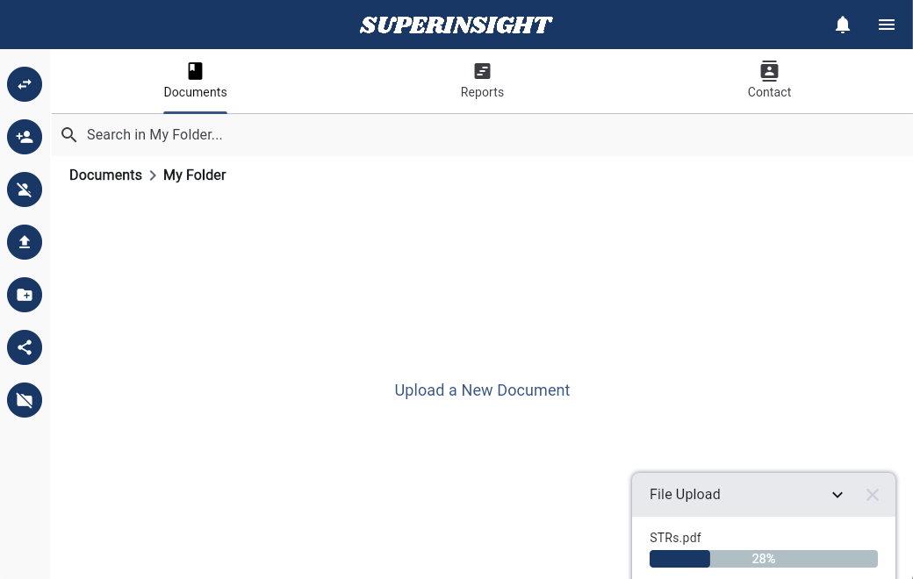
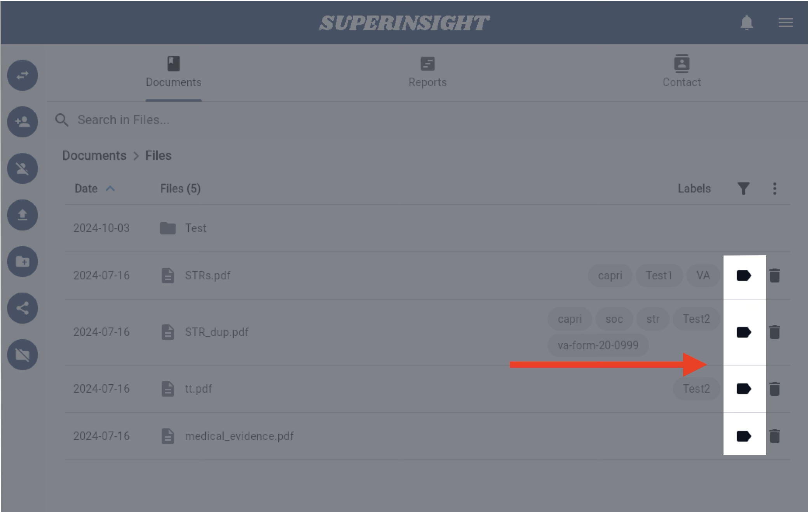
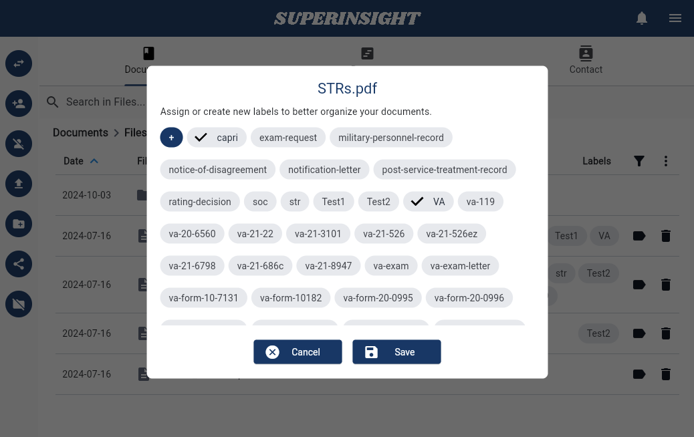
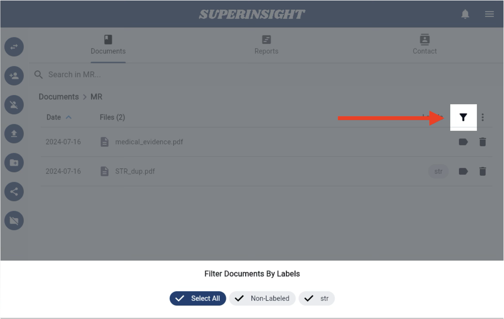
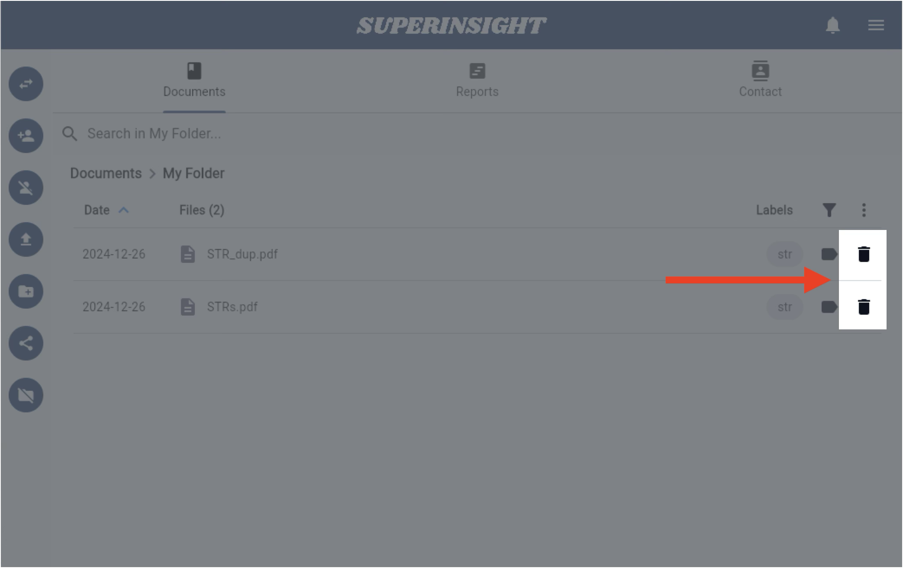

# Manage File

## 1. Upload Files

Depending on the purpose, you can upload files that can help your legal claims to the folders you created after you click into the folder level.

!!! TIP
    Now we support zip file upload! You can compress multiple files as one zip file and upload them at once. The maximum file size is 1GB.

Click the upload button on the left and select the files to upload. Once you submit the files, you can see a little window at the right-down corner of the screen showing your file upload progress.

After files are uploaded, you will see them in the folder with a red color processing icon on right and the file can not be clicked on. Behind the scenes, Superinsight is processing all the contents in your files. Depending on how large your files are, this process can take a few minutes to hours.

=== "Click to Upload"
    

=== "Uploading File"
    

=== "File In Progress"
    

=== "File Is Ready"
    

Once your file is ready, you will see the black label icon on right and now you can click on it and preview it in our viewer. Meanwhile, Superinsight will find you all the key points and insights from the file in real time.

=== "Original File"
    

=== "File Analysis"
    

## 2. File Labeling

During the file processing, your files would be auto-labeled as well. Superinsight categorizes all your files by type; with the filter, you can find certain files more easily.

Besides auto-labeling, you can also add or remove labels from the files by demand.

=== "Manage Labels"
    Click on the black icon to manage labels on this file.
    

=== "Add New Labels"
    You can assign existing labels to the files or create new labels by clicking + icon on left.
    

=== "Filter by Labels"
    Click on the filter icon and choose what labels you want to show. You can also use "Non-Labeled" to find all the non-labeled files.
    

## 3. Delete Files

If you need to delete files, click the file and get into file preview and you will see the "Delete File" button in the navigation on left. Click the button and confirm the deletion to remove the file.

=== "Delete File Button"
    

=== "Confirm Delete"
    